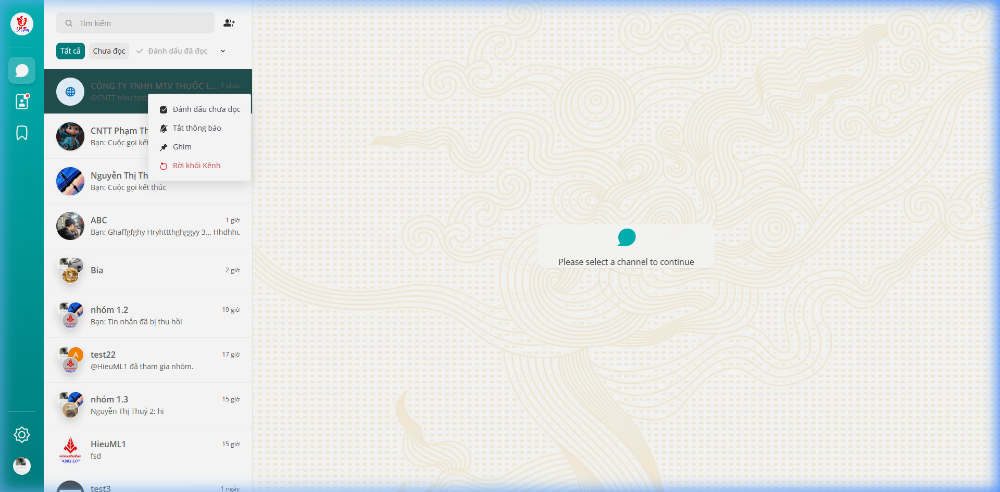
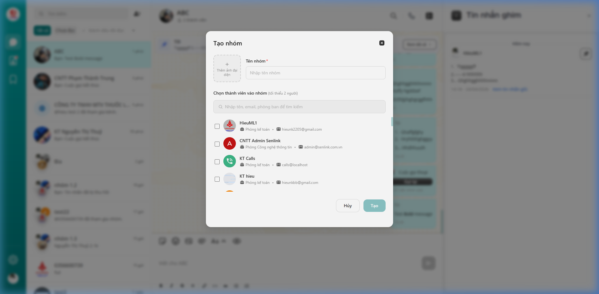
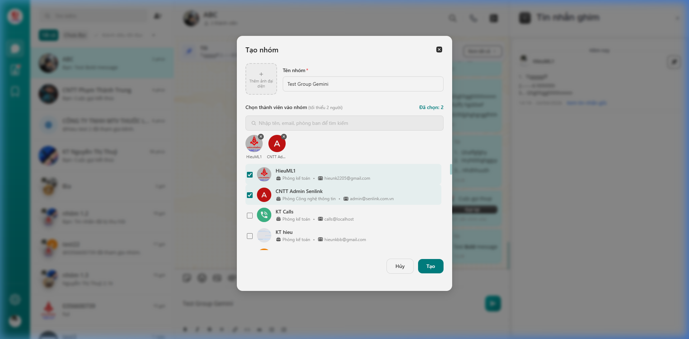
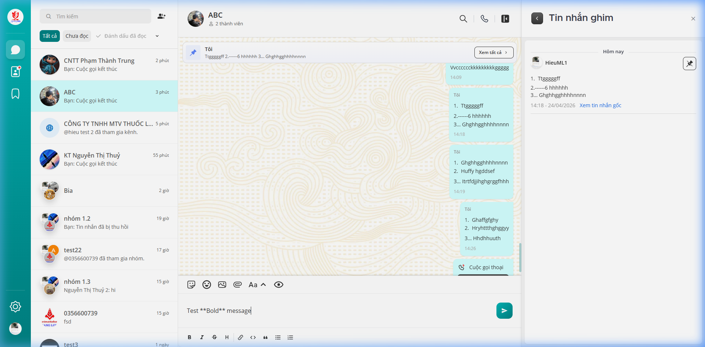
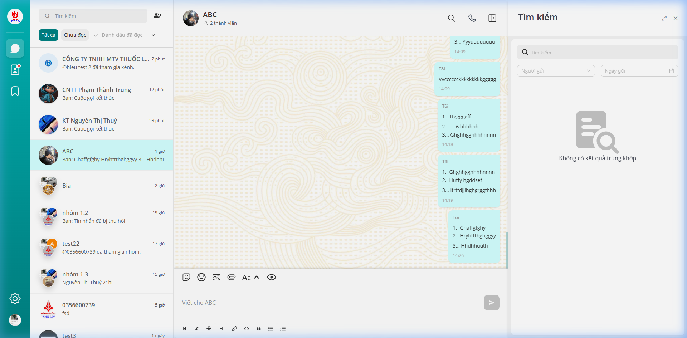
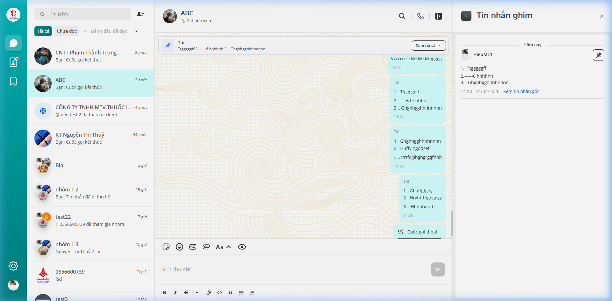
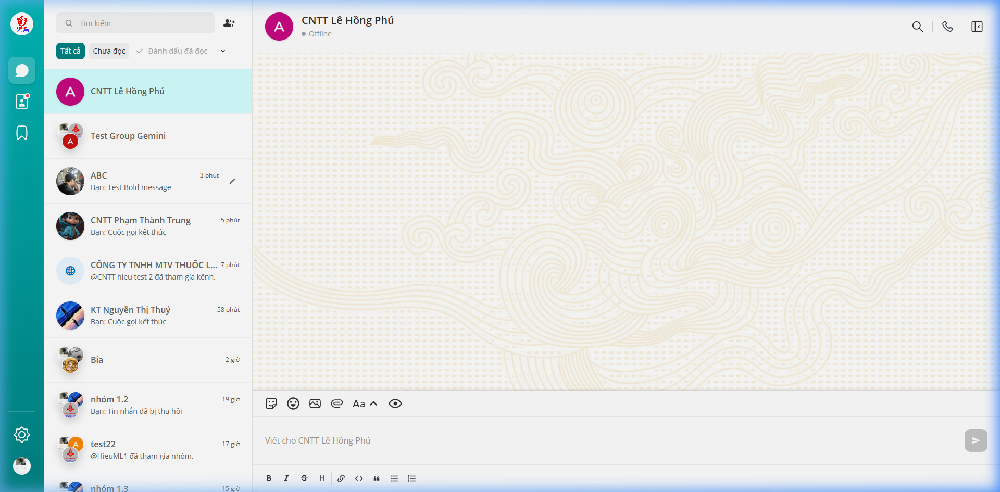
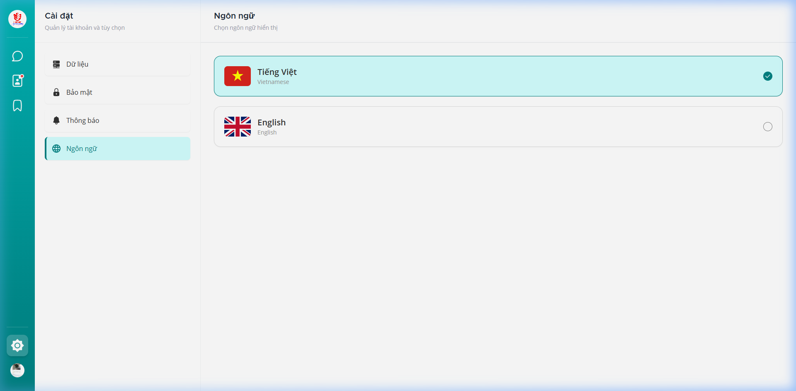

# Hướng dẫn sử dụng ứng dụng iThangLong

Tài liệu này cung cấp hướng dẫn chi tiết về các tính năng của ứng dụng chat iThangLong dành cho người dùng cuối, kèm theo hình ảnh minh họa từng bước.

---

## 1. Phân hệ Tin nhắn (Messages)

Phân hệ Tin nhắn là nơi diễn ra các cuộc hội thoại cá nhân và nhóm, cho phép trao đổi thông tin, tệp tin và thực hiện cuộc gọi.

### 1.1. Quản lý danh sách hội thoại
1. **Tổng quan:** Giúp người dùng nhanh chóng tìm kiếm và quản lý các cuộc hội thoại hiện có.
2. **Hướng dẫn thao tác:**
    - **Tìm kiếm & Lọc:** Nhập từ khóa vào ô **Tìm kiếm** hoặc chọn tab **Chưa đọc** để lọc.
    - **Thao tác nhanh (Chuột phải):** Nhấn chuột phải vào một hội thoại bất kỳ trong danh sách bên trái để mở menu nhanh:
        - **Đánh dấu chưa đọc**: Đánh dấu để xử lý sau.
        - **Tắt thông báo**: Ngừng nhận cảnh báo từ hội thoại này.
        - **Ghim**: Đưa hội thoại lên đầu danh sách.
        - **Rời khỏi Kênh / Xóa hội thoại**: Thoát khỏi nhóm hoặc xóa lịch sử chat.

### 1.2. Tạo nhóm chat mới
1. **Tổng quan:** Tạo không gian thảo luận chung cho nhiều thành viên.
2. **Hướng dẫn thao tác:**
    - **Bước 1:** Nhấn vào biểu tượng **Tạo nhóm** (hình người có dấu cộng) ở góc trên bên trái.
    

    
    - **Bước 2:** Nhập **Tên nhóm** và tích chọn các thành viên muốn thêm vào (tối thiểu 2 người).
    

    
    - **Bước 3:** Nhấn nút **Tạo** để hoàn tất.

### 1.3. Giao diện hội thoại và Công cụ hỗ trợ
1. **Tổng quan:** Cung cấp các công cụ tương tác mạnh mẽ và tìm kiếm trong cuộc trò chuyện.
2. **Hướng dẫn thao tác:**
    - **Gửi tin nhắn định dạng:** Nhấn vào biểu tượng **Aa** để mở thanh công cụ hoặc sử dụng cú pháp Markdown.
    

    
    - **Tìm kiếm trong hội thoại:** Nhấn biểu tượng **Kính lúp** trên thanh tiêu đề để mở thanh tìm kiếm tin nhắn ở bên phải.
    

    
    - **Thực hiện cuộc gọi:** Nhấn biểu tượng **Điện thoại/Video** trên thanh tiêu đề để bắt đầu cuộc gọi ngay lập tức.
    - **Xem tin nhắn ghim:** Nhấn vào biểu tượng **Xem thông tin** (chữ i hoặc biểu tượng danh sách) -> Chọn mục **Tin nhắn ghim** để xem danh sách các tin nhắn quan trọng.
    

---

## 2. Phân hệ Danh bạ (Phonebook)

### 2.1. Tìm kiếm và Bắt đầu trò chuyện
1. **Tổng quan:** Tìm kiếm đồng nghiệp và bắt đầu cuộc hội thoại trực tiếp từ danh bạ.
2. **Hướng dẫn thao tác:**
    - Vào mục **Danh bạ**, sử dụng ô tìm kiếm để tìm thành viên.
    - Nhấn vào biểu tượng **...** bên cạnh tên thành viên và chọn **Nhắn tin**.
    

---

## 3. Phân hệ Cài đặt (Settings)

### 3.1. Thay đổi Ngôn ngữ
1. **Tổng quan:** Chuyển đổi giữa Tiếng Việt và Tiếng Anh.
2. **Hướng dẫn thao tác:**
    - Vào **Cài đặt** > **Ngôn ngữ**.
    - Chọn ngôn ngữ mong muốn và hệ thống sẽ cập nhật ngay lập tức.
    

